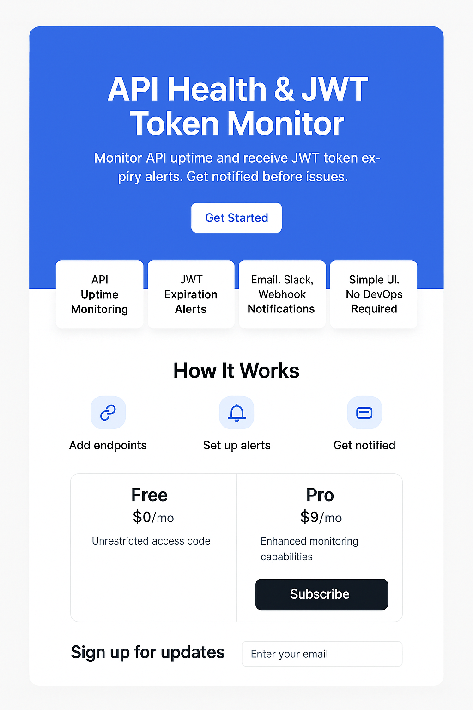

# API Monitor — Landing Page

This is a modern landing page for the **API Health & JWT Token Monitor** Micro SaaS. It provides developers with real-time monitoring of API uptime and JWT expiration, featuring a simple, clean interface built with React and Tailwind CSS.

 <!-- You can replace this with an actual screenshot URL later -->

---

## ✨ Features

- 🔍 **API Uptime Monitoring**
- 🔐 **JWT Expiration Alerts**
- 📬 **Email, Slack, Webhook Notifications**
- 📊 **Simple UI, No DevOps Required**
- 📥 Email signup integrated via Netlify or Google Sheets
- 📈 Privacy-first analytics with [Plausible](https://plausible.io) or [PostHog](https://posthog.com)

---

## 🛠 Tech Stack

- [React](https://reactjs.org/)
- [Tailwind CSS](https://tailwindcss.com/)
- [Vite](https://vitejs.dev/)
- [PostHog](https://posthog.com) (for analytics)
- Optional: Netlify / Vercel / Google Sheets for form handling

---

## 🚀 Getting Started

### 1. Clone the repo

```bash
git clone https://github.com/yourusername/api-monitor-landing.git
cd api-monitor-landing
